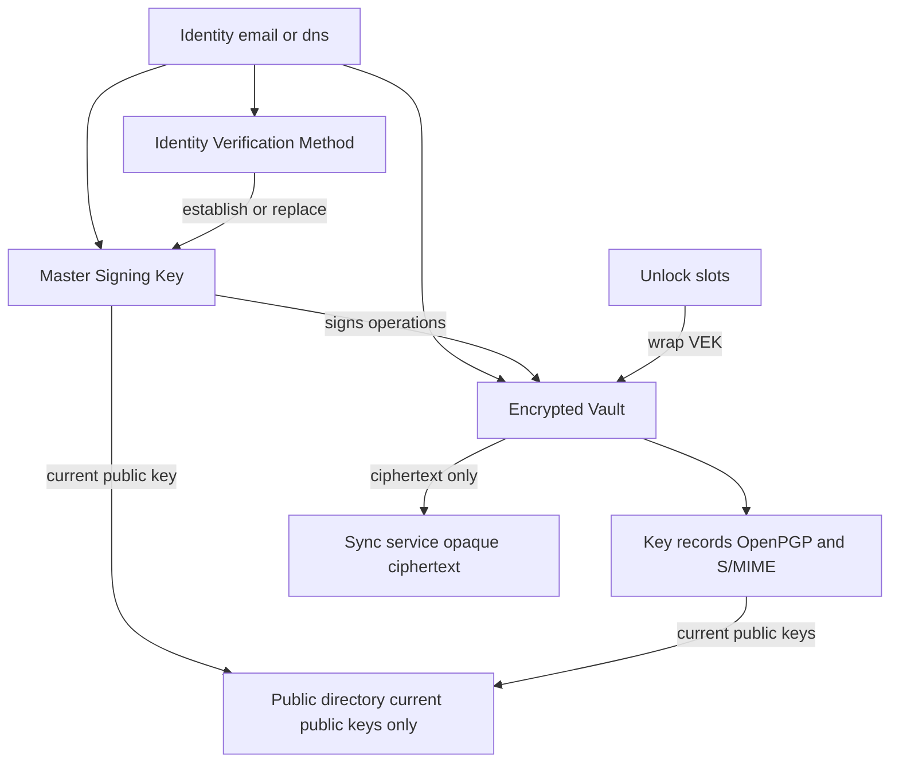

# Cryptographic Key Vault Format (CKVF)

**SComm.AI Draft 0.1**  
**Document version:** draft-0.1  
**Container format version:** `"1.0"`  
**Date:** 2026-08-17  
**Status:** SComm.AI-maintained draft, published at [scomm-public/ckvf](https://github.com/scomm-public/ckvf). This document is **not** an IETF Internet-Draft, RFC, or IETF standard.  
**License:** [BSD-2-Clause](LICENSE)

---

## Abstract

The Cryptographic Key Vault Format (CKVF) defines a lightweight, portable, user-controlled container in which private keys belong to a verified Identity, an independently encrypted vault retains current and historical keys across cryptographic ecosystems, a Master Signing Key (MSK) authorizes lifecycle changes, and ownership of the Identity can recover or replace that MSK. Multiple unlock mechanisms may protect one vault. Devices may synchronize and merge vault state. Public-key directory services may store and transport the encrypted vault without gaining access to its contents.

CKVF is the SComm.AI-maintained portable vault format. Third parties MAY implement this published specification; SComm.AI maintains the normative text and reference SDKs.

---

## Status of This Document

This document is **CKVF SComm.AI Draft 0.1**. It is published so product clients and third-party implementations can interoperate on the same container.

This document:

- MUST NOT be cited as an IETF standard;
- MUST NOT be described as “RFC”, “Internet-Draft”, or “IETF consensus” material;
- MAY be used as the source text for a future Independent Submission or Working Group Internet-Draft named along the lines of `draft-<authors>-ckvf`.

Normative requirements in this document apply to CKVF SComm.AI Draft 0.1 implementations. They do not create IETF protocol obligations.

Companion documents:

| Document | Role |
| --- | --- |
| [SECURITY-CONSIDERATIONS.md](SECURITY-CONSIDERATIONS.md) | Expanded security discussion |
| [PRIVACY-CONSIDERATIONS.md](PRIVACY-CONSIDERATIONS.md) | Expanded privacy discussion |
| [THREAT-MODEL.md](THREAT-MODEL.md) | Threat model |
| [INTEROPERABILITY.md](INTEROPERABILITY.md) | Interoperability profile |
| [docs/prior-art.md](docs/prior-art.md) | Prior art and reuse |
| [profiles/](profiles/) | Non-normative and profile documents |
| [ietf/draft-ckvf-community-00.md](ietf/draft-ckvf-community-00.md) | kramdown-rfc rendering of this draft |

---

## Table of Contents

1. [Introduction](#1-introduction)
2. [Terminology](#2-terminology)
3. [Architecture](#3-architecture)
4. [Data Model](#4-data-model)
5. [Serialization](#5-serialization)
6. [Cryptographic Processing](#6-cryptographic-processing)
7. [Identity Model](#7-identity-model)
8. [Master Signing Key (MSK)](#8-master-signing-key-msk)
9. [Key Records](#9-key-records)
10. [Vault Protection](#10-vault-protection)
11. [Synchronization](#11-synchronization)
12. [Merge Semantics](#12-merge-semantics)
13. [Extensibility](#13-extensibility)
14. [Versioning](#14-versioning)
15. [Error Handling](#15-error-handling)
16. [Security Considerations](#16-security-considerations)
17. [Privacy Considerations](#17-privacy-considerations)
18. [IANA Considerations](#18-iana-considerations)
19. [Examples](#19-examples)
20. [Test Vectors](#20-test-vectors)
21. [References](#21-references)

Appendices: [A. Registries](#appendix-a-community-registries), [B. Signed-operation payloads](#appendix-b-signed-operation-payloads), [C. Parser limits](#appendix-c-default-parser-limits)

---

## 1. Introduction

### 1.1. Why CKVF exists

Existing standards provide excellent representations for individual cryptographic keys, protocol-specific transferable secret keys, certificate/key packages, JSON keys, and enterprise KMS protocols.

They do not collectively define a lightweight, portable, user-controlled format in which:

* private keys belong to a verified Identity;
* one Identity may retain multiple current and historical private keys;
* different cryptographic ecosystems such as OpenPGP and S/MIME may coexist;
* an MSK authorizes lifecycle changes;
* ownership of the Identity can recover/replace that MSK;
* the vault is independently encrypted;
* multiple unlock mechanisms can protect one vault;
* devices can synchronize and merge vault state;
* historical keys remain available for old encrypted data;
* public-key services can synchronize the encrypted vault without gaining access to its contents.

CKVF standardizes this missing layer.

CKVF does not replace OpenPGP messages, S/MIME, CMS, certificate-chain validation, email MIME, encryption or signature algorithms, or post-quantum cryptography (PQC) algorithm specifications. See [Section 1.3](#13-what-ckvf-does-not-redefine).

### 1.2. Goals

CKVF is designed to:

1. Bind a set of private keys to a verified Identity.
2. Keep current and historical private keys available to the Identity holder.
3. Allow OpenPGP and S/MIME (and future families registered under this specification) to coexist in one vault.
4. Authorize lifecycle mutations with an MSK.
5. Allow Identity ownership proofs to establish or replace the MSK.
6. Encrypt the vault independently of any hosting service.
7. Support multiple unlock slots for one Vault Encryption Key (VEK).
8. Support multi-device synchronization with explicit generation tracking and deterministic merge rules.
9. Remain usable offline as a file format (no Discovery HTTP required to open a vault).

### 1.3. What CKVF does NOT redefine

CKVF MUST NOT be interpreted as redefining or replacing:

| Existing work | Role relative to CKVF |
| --- | --- |
| [RFC 9580](https://www.rfc-editor.org/rfc/rfc9580.html) OpenPGP | Message format, transferable keys, OpenPGP algorithms |
| [RFC 9980](https://www.rfc-editor.org/rfc/rfc9980.html) PQC in OpenPGP | OpenPGP post-quantum and composite algorithms; CKVF stores them as `algorithm` / `algorithm_suite` under `family` `"openpgp"` |
| [RFC 9580](https://www.rfc-editor.org/rfc/rfc9580.html) / OpenPGP transferable secret keys | Native encoding inside a CKVF key record (`openpgp-tsk`) |
| [RFC 5958](https://www.rfc-editor.org/rfc/rfc5958.html) PKCS #8 / Asymmetric Key Packages | Native encoding (`pkcs8`) |
| [RFC 7292](https://www.rfc-editor.org/rfc/rfc7292.html) PKCS #12 | Native encoding (`pkcs12`) |
| [RFC 7517](https://www.rfc-editor.org/rfc/rfc7517.html) JWK | Future encoding (`jwk`); not required in v1.0 |
| [RFC 7638](https://www.rfc-editor.org/rfc/rfc7638.html) JWK Thumbprint | Future absolute key identification for `jwk` |
| [RFC 8785](https://www.rfc-editor.org/rfc/rfc8785.html) JCS | Canonical JSON for hashes, AAD, and signatures |
| [RFC 9106](https://www.rfc-editor.org/rfc/rfc9106.html) Argon2 | Password-based KDF |
| [RFC 8555](https://www.rfc-editor.org/rfc/rfc8555.html) ACME | Conceptual inspiration for DNS-01 only; CKVF is not ACME |
| [RFC 8551](https://www.rfc-editor.org/rfc/rfc8551.html) S/MIME | Message security |
| [RFC 5652](https://www.rfc-editor.org/rfc/rfc5652.html) CMS | Cryptographic Message Syntax |
| [RFC 5280](https://www.rfc-editor.org/rfc/rfc5280.html) PKIX | Certificates, SPKI, path validation |
| OASIS KMIP | Enterprise key-management protocol |

Post-quantum algorithms MUST NOT be introduced as a peer key family. PQC appears only as `algorithm` and/or `algorithm_suite` under an existing family such as `openpgp` or `smime`.

### 1.4. SComm.AI maintenance and layering

CKVF is the SComm.AI-maintained portable vault **container**. The specification and reference SDKs live in this repository ([scomm-public/ckvf](https://github.com/scomm-public/ckvf)).

SComm.AI products and `pubkey.scomm.ai` / `discovery.scomm.ai` use CKVF for encrypted private-key history. Discovery Protocol HTTP, MSK enroll, and hosted `vault_*` sync are **not** defined in this document; they belong in [`discovery-protocol`](https://github.com/scomm-public/discovery-protocol) and Pubkey client/server SDKs.

A CKVF implementation:

- MAY be written by SComm.AI or by a third party against this specification;
- MUST NOT require a network round-trip to parse, unlock, or use a vault file;
- MUST NOT pull Discovery HTTP or hosted vault APIs into the container libraries in this repository;
- MAY optionally speak a public-key directory or sync protocol, including the [reference-key-service profile](profiles/reference-key-service.md).

Hosted-service differences belong in adapters. See [profiles/scomm-pubkey-migration.md](profiles/scomm-pubkey-migration.md).

### 1.5. Requirements language

The key words "**MUST**", "**MUST NOT**", "**REQUIRED**", "**SHALL**", "**SHALL NOT**", "**SHOULD**", "**SHOULD NOT**", "**RECOMMENDED**", "**NOT RECOMMENDED**", "**MAY**", and "**OPTIONAL**" in this document are to be interpreted as described in [RFC 2119](https://www.rfc-editor.org/rfc/rfc2119.html) and [RFC 8174](https://www.rfc-editor.org/rfc/rfc8174.html) when, and only when, they appear in all capitals, as shown here.

These terms are defined once in this document and apply to the entire CKVF SComm.AI Draft 0.1 documentation set unless a companion document explicitly states otherwise.

---

## 2. Terminology

**Absolute Key ID**  
The authoritative identifier of a key record: base64url(SHA-256(canonical public key bytes)). Short Key IDs are not Absolute Key IDs.

**AEAD**  
Authenticated Encryption with Associated Data. CKVF v1.0 uses AES-256-GCM (`A256GCM`).

**Canonical public key bytes**  
The exact byte string hashed to produce `absolute_key_id`. Defined per encoding in [Section 9.4](#94-canonical-public-key-bytes).

**CKVF container** / **outer vault container**  
The JSON object with `format` equal to `"CKVF"` that wraps ciphertext, unlock slots, and generation metadata.

**Community registry**  
A table in [Appendix A](#appendix-a-community-registries) maintained with this specification. These registries are structured for later IANA migration and are not IANA registries.

**Device**  
An endpoint that can unlock a vault and apply signed operations. CKVF does not mandate a vendor secure-storage API.

**Encrypted payload**  
The JSON object encrypted under the VEK. It contains identity, MSK, keys, metadata, tombstones, and extensions.

**Generation**  
A strictly increasing integer identifying a committed vault state for a given `vault_id`.

**Identity**  
A verified identifier of type `email` or `dns` (v1.0), represented by a canonical value and an `identity_id`.

**Identity Verification Method (IVM)**  
A proof that the presenter currently controls the Identity (for example, email-otp or dns-01). IVM artifacts MUST NOT be stored in the vault.

**JCS**  
JSON Canonicalization Scheme as specified in RFC 8785. CKVF uses UTF-8 JCS; implementations MUST NOT invent a custom canonicalization.

**KEK**  
Key Encryption Key wrapping the VEK inside an unlock slot.

**Key family**  
A cryptographic ecosystem identifier. v1.0 families are `openpgp` and `smime` only. PQC is not a family.

**Master Signing Key (MSK)**  
The Ed25519 key pair that authorizes CKVF signed operations for an Identity’s vault.

**Public directory**  
A service or document that publishes *current public keys* for an Identity. It is not the vault.

**Short Key ID**  
A non-unique lookup hint derived from the first 32 bits of the Absolute Key ID digest. Applications MUST tolerate collisions.

**Tombstone**  
A record that a private key was deleted under an authorized `DELETE_PRIVATE_KEY` operation.

**Unlock slot**  
A method-specific wrapping of the VEK. Several slots MAY wrap the same VEK.

**Vault**  
The encrypted payload plus its outer container. The vault holds historical private keys. The public directory does not.

**Vault Encryption Key (VEK)**  
A 256-bit uniformly random key that AEAD-encrypts the payload. The VEK MUST NOT be derived directly from a password.

**Vault ID**  
A 16-byte random identifier, encoded as unpadded base64url, unique per vault instance.

---

## 3. Architecture

### 3.1. Conceptual model

```
Identity
  +-- Identity Verification Method
  +-- Master Signing Key (MSK)
  +-- Vault
        +-- Private Key / Historical Private Key (any registered family)
```

An Identity has at most one current MSK and zero or more historical MSK *public* keys. The vault is independently encrypted. Unlock slots protect the VEK, not individual keys.



### 3.2. Public directory versus vault

| Property | Public directory | Vault |
| --- | --- | --- |
| Contents | Current public keys, current MSK public key, Identity | Current and historical private keys, MSK private key, metadata |
| Confidentiality | Public | Independently encrypted |
| Historical private keys | MUST NOT be published | MAY be retained |
| Service access | Readable by others | Ciphertext MAY be stored; plaintext MUST NOT be required |

A public-key service MAY synchronize the encrypted vault as an opaque blob. The service MUST NOT need plaintext private keys to provide storage or generation-conflict detection on the outer container.

### 3.3. Actors

| Actor | Authority |
| --- | --- |
| Identity holder | Unlocks vault, holds MSK private key, authorizes operations |
| Device | Stores optional device-wrapped KEK; MUST NOT be the sole normative unlock method |
| Sync / directory service | Stores ciphertext, verifies signed operations it is willing to accept, publishes current public keys |
| Peer / correspondent | Consumes public keys; does not access the vault |

### 3.4. Lifecycle overview

1. Prove Identity ownership (email-otp or dns-01 profile).
2. `ESTABLISH_MSK` for a new Identity, or `REPLACE_MSK` when recovering control.
3. Generate a random VEK, encrypt an empty or imported payload, and create at least one unlock slot.
4. Import or generate family keys; emit `ADD_KEY` (and optionally `SET_PREFERRED_KEY`).
5. Commit a new generation (`COMMIT_VAULT_GENERATION`) and optionally upload ciphertext.
6. Devices pull, verify generation hashes, merge if needed, and push a new generation.

---

## 4. Data Model

This section is **normative**. Schemas and SDKs MUST match these objects, field names, types, and encodings.

Unknown fields in the normative core MUST be rejected, except inside `extensions` / `critical_extensions` entries and inside `metadata` objects as defined below. Implementations MUST NOT accept arbitrary extra JSON keys on core objects.

### 4.1. Outer vault container

The outer container is a JSON object. `version` for this specification is the string `"1.0"`.

```json
{
  "format": "CKVF",
  "version": "1.0",
  "vault_id": "<base64url, 16 random bytes>",
  "generation": 1,
  "previous_generation_hash": null,
  "generation_hash": "<base64url SHA-256>",
  "crypto": {
    "aead": "A256GCM",
    "iv": "<base64url, 12 bytes>"
  },
  "unlock_slots": [],
  "ciphertext": "<base64url>",
  "tag": "<base64url, 16 bytes>",
  "extensions": [],
  "critical_extensions": []
}
```

Field requirements:

| Field | Type | Requirement |
| --- | --- | --- |
| `format` | string | MUST be `"CKVF"` |
| `version` | string | MUST be `"1.0"` for this container version |
| `vault_id` | string | Unpadded base64url of 16 octets. MUST be generated with a CSPRNG. MUST be constant for the life of the vault instance |
| `generation` | integer | MUST be a JSON number that is an integer ≥ 1. Generation 1 is the first committed state |
| `previous_generation_hash` | string or null | MUST be `null` if and only if `generation` is 1. Otherwise MUST equal the previous container’s `generation_hash` |
| `generation_hash` | string | Unpadded base64url of SHA-256 as defined in [Section 6.2](#62-generation-hash) |
| `crypto.aead` | string | MUST be `"A256GCM"` in version `"1.0"` |
| `crypto.iv` | string | Unpadded base64url of 12 octets (96-bit GCM nonce) |
| `unlock_slots` | array | Zero or more unlock slot objects. A vault with zero slots is not unlockable; writers SHOULD include at least one |
| `ciphertext` | string | Unpadded base64url of AES-256-GCM ciphertext (payload JSON UTF-8, no tag) |
| `tag` | string | Unpadded base64url of 16 octets (128-bit GCM tag) |
| `extensions` | array | Non-critical container extensions; MAY be empty |
| `critical_extensions` | array | Critical container extensions; MAY be empty |

Binary encoding throughout the container and payload is **base64url WITHOUT padding** ([RFC 4648](https://www.rfc-editor.org/rfc/rfc4648.html) Section 5) unless an imported key standard requires a native encoding *inside* the encrypted payload (`private_key` / `public_key` still use unpadded base64url of those native bytes).

### 4.2. Unlock slot

```json
{
  "slot_id": "<base64url 16 bytes>",
  "method": "password-argon2id",
  "created_at": "<RFC 3339 UTC>",
  "kdf": {
    "alg": "Argon2id",
    "salt": "<base64url >=16 bytes>",
    "m": 65536,
    "t": 3,
    "p": 4,
    "key_length": 32
  },
  "wrap": {
    "alg": "A256GCM",
    "iv": "<base64url 12 bytes>",
    "ciphertext": "<base64url 32-byte VEK>",
    "tag": "<base64url 16 bytes>"
  }
}
```

| Field | Requirement |
| --- | --- |
| `slot_id` | Unpadded base64url of 16 CSPRNG octets. Unique among slots of this vault |
| `method` | Community-registry identifier. v1.0 password method is `"password-argon2id"` |
| `created_at` | RFC 3339 timestamp in UTC with a `Z` suffix |
| `kdf` | REQUIRED for `"password-argon2id"`. MUST be omitted or ignored according to the method definition for methods that do not use a KDF |
| `wrap` | REQUIRED. Wraps the 32-byte VEK |

For `"password-argon2id"`:

- `kdf.alg` MUST be `"Argon2id"`.
- `kdf.salt` MUST decode to at least 16 octets.
- `kdf.m` is memory in **KiB** (RFC 9106). The RECOMMENDED value is `65536` (64 MiB).
- `kdf.t` is iterations. The RECOMMENDED value is `3`.
- `kdf.p` is parallelism. The RECOMMENDED value is `4`.
- `kdf.key_length` MUST be `32`.
- These parameters match RFC 9106’s second recommended option.

The password is NEVER stored. Implementations MUST NOT write a password, password hash, or password verifier into the container, payload, or extensions.

Device-oriented methods MAY omit `kdf` and obtain a KEK from platform secure storage. This specification does **not** make any vendor secure-storage API normative. See [Section 10.4](#104-device-slots).

### 4.3. Encrypted payload

The AEAD plaintext is the UTF-8 encoding of a JSON object:

```json
{
  "identity": {
    "type": "email",
    "value": "<canonical>",
    "identity_id": "<base64url SHA-256>"
  },
  "msk": {
    "current": {
      "msk_id": "<base64url SHA-256 of public_key bytes>",
      "algorithm": "Ed25519",
      "public_key": "<base64url 32 bytes>",
      "private_key": "<base64url 32-byte seed>",
      "activated_at": "<RFC 3339>"
    },
    "history": []
  },
  "keys": [],
  "preferred_keys": {},
  "metadata": {
    "created_at": "<RFC 3339>",
    "updated_at": "<RFC 3339>"
  },
  "tombstones": [],
  "extensions": [],
  "critical_extensions": []
}
```

`identity.type` MUST be `"email"` or `"dns"` in version `"1.0"`.

Implementations MAY omit storing a plaintext copy of the Identity *outside* the encrypted vault. The Identity inside the payload is REQUIRED.

`msk.history` is an array of historical MSK **public** records. Historical MSK **private** keys MUST NOT be stored. See [Section 8](#8-master-signing-key-msk).

`keys` is an array of key records ([Section 4.4](#44-key-record)).

`preferred_keys` is an object keyed by family, then by purpose, whose values are Absolute Key IDs:

```json
{
  "openpgp": {
    "sign": "<absolute_key_id>",
    "encrypt": "<absolute_key_id>"
  },
  "smime": {
    "sign": "<absolute_key_id>",
    "encrypt": "<absolute_key_id>"
  }
}
```

Omitted families or purposes mean “no preference recorded”. Values MUST refer to a key record that exists in `keys` and is not tombstoned, unless a conflict is being represented during merge (merge MUST NOT silently pick; see [Section 12.5](#125-preferred_keys)).

`metadata` MUST contain `created_at` and `updated_at` as RFC 3339 UTC timestamps. Additional `metadata` keys are permitted only if registered or placed under an extension. Unregistered extra keys in `metadata` MUST be rejected by v1.0 parsers (use `extensions` instead).

### 4.4. Key record

```json
{
  "absolute_key_id": "<base64url SHA-256(canonical public key bytes)>",
  "short_key_id": "ABCD-EF12",
  "family": "openpgp",
  "algorithm": "<registry>",
  "algorithm_suite": null,
  "encoding": "openpgp-tsk",
  "purpose": ["sign", "encrypt", "auth"],
  "public_key": "<base64url canonical public key>",
  "private_key": "<base64url native encoding or null if deleted>",
  "created_at": "<RFC 3339>",
  "status": "active",
  "metadata": {}
}
```

| Field | Requirement |
| --- | --- |
| `absolute_key_id` | Authoritative ID. MUST equal unpadded base64url(SHA-256(canonical public key bytes)) |
| `short_key_id` | Lookup hint only. MUST match [Section 9.5](#95-short-key-ids). **NOT a unique identifier** |
| `family` | `"openpgp"` or `"smime"` in v1.0. MUST NOT be `"pq"`, `"pqc"`, or similar |
| `algorithm` | Registry string ([Appendix A.3](#a3-algorithms)) |
| `algorithm_suite` | Registry string or JSON `null`. PQC hybrid/composite suites belong here or in `algorithm`, never as a family |
| `encoding` | `"openpgp-tsk"`, `"pkcs8"`, or `"pkcs12"` in v1.0 |
| `purpose` | Array subset of `"sign"`, `"encrypt"`, `"auth"`. MUST contain at least one value. Duplicate values MUST be rejected |
| `public_key` | Unpadded base64url of canonical public key bytes |
| `private_key` | Unpadded base64url of native private-key encoding, or JSON `null` after authorized deletion |
| `created_at` | RFC 3339 UTC |
| `status` | `"active"`, `"retired"`, `"revoked"`, or `"compromised"` |
| `metadata` | Object. v1.0 parsers MUST accept an empty object and MUST reject unregistered keys; use extensions on the payload for extra data |

**Statuses:** `retired` does **not** mean delete the private key. Historical retention is a design objective. Deletion is a separate action: a tombstone plus an authorized `DELETE_PRIVATE_KEY` operation that sets `private_key` to `null`. Implementations MUST NOT equate retire with delete.

### 4.5. Tombstone

```json
{
  "absolute_key_id": "<base64url>",
  "deleted_at": "<RFC 3339 UTC>",
  "nonce": "<base64url 32 bytes>",
  "reason": "user-requested"
}
```

`reason` MUST be one of `"user-requested"`, `"compromised-purge"`, or `"policy"`.

A tombstone MUST be appended when `DELETE_PRIVATE_KEY` succeeds. The corresponding key record MUST remain (for public metadata and status) unless a future profile defines full record removal; v1.0 MUST keep the record with `private_key` equal to `null`.

### 4.6. Extension object

```json
{
  "id": "std:example",
  "critical": false,
  "data": {}
}
```

| Field | Requirement |
| --- | --- |
| `id` | String matching `std:`, `exp:`, or `priv:` prefix rules ([Section 13](#13-extensibility)) |
| `critical` | JSON boolean. MUST equal `true` if and only if the object appears in a `critical_extensions` array |
| `data` | JSON value defined by the extension specification. MUST be present |

Core objects MUST NOT contain loose arbitrary JSON properties. Extensions are the only forward-compatible data channel.

### 4.7. Signed operation

CKVF uses RFC 8785 JCS. Implementations MUST NOT define a custom canonicalization.

The **signed object** (`body`) MUST contain exactly these fields, with no `signature` field inside `body`:

| Field | Type | Value |
| --- | --- | --- |
| `protocol` | string | MUST be `"CKVF"` |
| `protocol_version` | string | MUST be `"1.0"` |
| `operation` | string | Registry operation name |
| `identity_id` | string | Identity ID of the vault |
| `vault_id` | string | Vault ID |
| `generation` | integer | Generation the operation is intended to apply to, or the generation being committed, as defined per operation |
| `nonce` | string | Unpadded base64url of 32 CSPRNG octets |
| `timestamp` | string | RFC 3339 UTC |
| `payload_hash` | string | Unpadded base64url(SHA-256(UTF-8 JCS(`payload`))) |

The **envelope** is:

```json
{
  "body": {
    "protocol": "CKVF",
    "protocol_version": "1.0",
    "operation": "ADD_KEY",
    "identity_id": "<identity_id>",
    "vault_id": "<vault_id>",
    "generation": 1,
    "nonce": "<base64url 32 bytes>",
    "timestamp": "<RFC 3339 UTC>",
    "payload_hash": "<base64url SHA-256>"
  },
  "payload": {},
  "signature": {
    "algorithm": "Ed25519",
    "msk_id": "<msk_id>",
    "value": "<base64url 64 bytes>"
  }
}
```

Operations in version `"1.0"`:

`ADD_KEY`, `RETIRE_KEY`, `REVOKE_KEY`, `SET_PREFERRED_KEY`, `ADD_DEVICE`, `REMOVE_DEVICE`, `COMMIT_VAULT_GENERATION`, `MERGE_VAULT`, `UPDATE_METADATA`, `DELETE_PRIVATE_KEY`, `ESTABLISH_MSK`, `REPLACE_MSK`.

Payload schemas are in [Appendix B](#appendix-b-signed-operation-payloads).

---

## 5. Serialization

### 5.1. JSON

The outer container, encrypted payload, unlock slots, key records, tombstones, extensions, and signed envelopes are JSON as defined by [RFC 8259](https://www.rfc-editor.org/rfc/rfc8259.html).

Implementations MUST serialize JSON objects that are hashed or signed using RFC 8785 JCS. Pretty-printed JSON is permitted on disk only if the implementation canonicalizes before hashing, AEAD AAD, or signing. Interchange RECOMMENDED form is compact JCS.

### 5.2. Integers

`generation`, KDF parameters, and similar fields MUST be JSON numbers that are integers in the inclusive ranges defined in this specification. Implementations MUST reject non-integers, leading zeros in the JCS sense (JCS forbids them), NaN, and infinities.

### 5.3. Timestamps

All timestamps MUST be RFC 3339 date-times in UTC with a `Z` suffix. Implementations MUST reject timestamps with a numeric offset in v1.0 (use `Z` only). Fractional seconds MAY be included; comparators MUST treat timestamps as opaque RFC 3339 strings for equality and MUST parse them for ordering.

Timestamps are **not** the primary consistency mechanism for vault state. Generations and hashes are.

### 5.4. Base64url

Unless a nested native key encoding specifies otherwise, every binary field is encoded as base64url **without padding** (RFC 4648 Section 5). Implementations MUST reject padded base64url, standard base64 (with `+`/`/`), and decoded lengths that do not match the field’s required size.

### 5.5. Unicode

JSON strings are Unicode. Identity canonicalization uses Unicode NFC ([UAX #15](https://unicode.org/reports/tr15/)) before other steps. JCS applies RFC 8785 Unicode escaping rules. Implementations MUST NOT apply a second, CKVF-specific string canonicalization to signed or hashed JSON.

---

## 6. Cryptographic Processing

CKVF does not invent cryptographic primitives. Version `"1.0"` uses AES-256-GCM, SHA-256, Argon2id, and Ed25519 as specified by their RFCs.

### 6.1. Vault AEAD (AES-256-GCM)

- Algorithm: AES-256-GCM (`A256GCM`).
- IV: 96 bits (12 octets), encoded in `crypto.iv`. The IV MUST be unique for a given VEK. Writers MUST generate IVs with a CSPRNG.
- Tag: 128 bits (16 octets), encoded in `tag`.
- VEK: 256 bits (32 octets), uniformly random. The VEK MUST NOT be derived directly from a password.
- Plaintext: UTF-8 JSON of the encrypted payload object.
- Ciphertext: GCM ciphertext **excluding** the tag, encoded in `ciphertext`.

**AAD** is the UTF-8 JCS encoding of the following object (keys sorted by RFC 8785; shown here in sorted order):

```json
{
  "critical_extensions": [],
  "crypto": { "aead": "A256GCM", "iv": "<iv>" },
  "extensions": [],
  "format": "CKVF",
  "generation": 1,
  "previous_generation_hash": null,
  "unlock_slots": [],
  "vault_id": "...",
  "version": "1.0"
}
```

The AAD object MUST include exactly these members, with values copied from the container:

- `critical_extensions`
- `crypto` containing exactly `aead` and `iv`
- `extensions`
- `format`
- `generation`
- `previous_generation_hash`
- `unlock_slots`
- `vault_id`
- `version`

Implementations MUST NOT include `ciphertext`, `tag`, or `generation_hash` in the AAD.

Because `unlock_slots` is in the AAD, adding or removing a slot changes the AAD. Implementations MUST recompute the GCM tag over the **same** ciphertext and IV (the payload keys are not re-encrypted). Implementations MUST then recompute `generation_hash` and MUST increment `generation` when committing that change ([Section 10.3](#103-password-change) and [Section 10.4](#104-device-slots)).

Decryption MUST verify the GCM tag. On failure, implementations MUST NOT return plaintext and MUST return `ERR_AEAD_DECRYPT`.

### 6.2. Generation hash

```
generation_hash = base64url(SHA-256(UTF-8 JCS(container_without_generation_hash)))
```

`container_without_generation_hash` is the outer container object with the `generation_hash` member omitted (not set to `null`). All other members, including `ciphertext` and `tag`, MUST be present.

Verifiers MUST recompute `generation_hash` and MUST reject a mismatch (`ERR_GENERATION_HASH`).

### 6.3. Unlock-slot wrap (AES-256-GCM)

The wrap algorithm in version `"1.0"` is `A256GCM`.

- Wrap IV: 96 bits, unique per wrap under a given KEK.
- Wrap tag: 128 bits.
- Wrap plaintext: the 32-byte VEK.
- Wrap ciphertext: 32 bytes (AES-GCM ciphertext of a 32-byte plaintext with no expansion other than the tag stored separately).

**Wrap AAD** is UTF-8 JCS of an object with exactly three members:

```json
{
  "method": "password-argon2id",
  "slot_id": "<slot_id>",
  "vault_id": "<vault_id>"
}
```

RFC 8785 sorts keys as `method`, `slot_id`, `vault_id`. Implementations MUST use the slot’s `method` and `slot_id` and the container’s `vault_id`.

### 6.4. Password KDF (Argon2id)

For `method` `"password-argon2id"`, the KEK is:

```
KEK = Argon2id(
  password,
  salt = kdf.salt,
  m = kdf.m,
  t = kdf.t,
  p = kdf.p,
  tagLength = kdf.key_length
)
```

as specified in RFC 9106. `tagLength` MUST be 32 octets.

The RECOMMENDED parameters (RFC 9106 second recommended option) are `m=65536` (KiB), `t=3`, `p=4`.

Implementations MUST reject unsafe parameters ([Section 6.5](#65-unsafe-kdf-parameters)). Implementations MUST enforce default parser limits ([Appendix C](#appendix-c-default-parser-limits)).

Password change ([Section 10.3](#103-password-change)): unwrap the VEK with the old slot, wrap with a new KEK, replace the slot, recompute the outer AEAD tag and `generation_hash`. Implementations MUST NOT re-encrypt payload keys solely because the password changed.

### 6.5. Unsafe KDF parameters

For `"password-argon2id"`, implementations MUST reject a slot if any of the following hold:

| Condition | Reason |
| --- | --- |
| `kdf.alg` ≠ `"Argon2id"` | Wrong algorithm |
| decoded `salt` length < 16 | Insufficient salt |
| `key_length` ≠ 32 | Wrong KEK size |
| `m` < 16384 | Memory-hard parameter too small (16 MiB minimum) |
| `t` < 2 | Iteration count too small |
| `p` < 1 | Invalid parallelism |
| `m`, `t`, or `p` exceed parser limits | Resource exhaustion |
| `m * p` would overflow the implementation’s Argon2 limiter | Resource exhaustion |

Implementations MAY reject additional parameters they cannot allocate. They MUST NOT silently lower `m`, `t`, or `p`.

### 6.6. MSK signatures (Ed25519)

`signature.algorithm` MUST be `"Ed25519"` in protocol version `"1.0"`.

```
signature.value = Ed25519Sign(MSK_private_seed, UTF-8 JCS(body))
```

The signed message is the JCS encoding of `body` only, not the envelope. Verifiers MUST:

1. Recompute `payload_hash` from `payload` and reject on mismatch (`ERR_PAYLOAD_HASH`).
2. Verify `body` contains exactly the required fields.
3. Verify Ed25519 over UTF-8 JCS(`body`) using the public key identified by `signature.msk_id`.
4. Reject if `msk_id` is not the current MSK, except `REPLACE_MSK` and `ESTABLISH_MSK` as specified in [Section 8](#8-master-signing-key-msk).

Ed25519 private keys in CKVF are RFC 8032 **32-byte seeds**, not the 64-byte expanded form.

### 6.7. Replay protection

Replay protection uses `nonce` (256-bit) plus `timestamp`.

- Producers MUST generate a fresh CSPRNG nonce per envelope.
- Consumers that accept operations across a network or device boundary MUST reject nonce reuse within their replay window (`ERR_REPLAY`).
- Servers MAY apply a clock-skew tolerance such as ±5 minutes. **That tolerance is not a file-format constant** and MUST NOT be encoded as a CKVF container field. Offline file consumers MAY ignore clock skew and still MUST reject duplicate nonces they have recorded.

### 6.8. Hash function

SHA-256 ([FIPS 180-4](https://csrc.nist.gov/publications/detail/fips/180/4/final) / [RFC 6234](https://www.rfc-editor.org/rfc/rfc6234.html)) is the only hash used for `identity_id`, `msk_id`, `absolute_key_id`, `generation_hash`, `payload_hash`, and dns-01 challenges in version `"1.0"`.

---

## 7. Identity Model

### 7.1. Identity object

An Identity is `{ type, value, identity_id }` inside the encrypted payload.

```
identity_id = base64url(SHA-256(UTF-8(canonical_type + ":" + canonical_value)))
```

`canonical_type` is the `type` string (`"email"` or `"dns"`). `canonical_value` is defined below. The colon is a single U+003A character. Implementations MUST recompute `identity_id` and MUST reject a mismatch (`ERR_IDENTITY_ID`).

### 7.2. Email canonicalization (v1.0)

Given a Unicode email string `raw`:

1. Apply Unicode NFC.
2. Trim ASCII space (U+0020) and Unicode whitespace as defined by Unicode White_Space from both ends.
3. Split on the **last** U+0040 (`@`). If there is no `@`, or either side is empty, reject (`ERR_IDENTITY_CANON`).
4. **Local-part (v1.0):** interpret as ASCII. If any code point is greater than U+007F, reject. Convert the local-part to ASCII lowercase (A–Z → a–z only).
5. **Domain:** apply IDNA ToASCII ([RFC 5891](https://www.rfc-editor.org/rfc/rfc5891.html) / IDNA2008) with the UseSTD3ASCIIRules processing expected for domain names, then ASCII-lowercase the result. Strip a single trailing dot if present. The result MUST NOT contain a trailing dot.
6. Reassemble `local-part + "@" + domain`.

v1.0 does not define internationalized local-parts. Profiles MAY define a later version.

### 7.3. DNS canonicalization (v1.0)

Given a Unicode domain string `raw`:

1. Apply Unicode NFC.
2. Trim White_Space.
3. Strip **all** trailing dots.
4. Apply IDNA ToASCII, then ASCII-lowercase.
5. The result MUST NOT have a trailing dot. If empty, reject.

### 7.4. Ownership proofs

Identity ownership is proven by an Identity Verification Method. Version `"1.0"` defines two profiles:

- [email-otp](profiles/email-otp.md) — security properties only; no vendor OTP API.
- [dns-01](profiles/dns-01.md) — inspired by ACME DNS-01; **not** ACME.

Proof artifacts (OTP values, challenge nonces, TXT records) MUST NOT be stored in the vault.

`REPLACE_MSK` REQUIRES a fresh Identity ownership proof unless a future recovery profile, registered as an extension, explicitly says otherwise.

### 7.5. Identity mismatch

A merge or import that would associate a vault with a different `identity_id` MUST be rejected (`ERR_IDENTITY_MISMATCH`). Changing Identity is not a v1.0 operation.

---

## 8. Master Signing Key (MSK)

### 8.1. Current MSK

`msk.current.algorithm` MUST be `"Ed25519"` in version `"1.0"`.

```
msk_id = base64url(SHA-256(public_key_bytes))
```

`public_key_bytes` are the 32-byte Ed25519 public key (RFC 8032), not the base64url encoding. `private_key` is the 32-byte seed.

Implementations MUST recompute `msk_id` and MUST reject a mismatch.

### 8.2. History

When the MSK is replaced:

1. Implementations MUST append a history entry containing `msk_id`, `algorithm`, `public_key`, `activated_at`, and `retired_at` (RFC 3339 UTC).
2. Implementations MUST NOT copy `private_key` into history.
3. Implementations MUST securely erase the old MSK private key from the payload (and SHOULD erase in-memory copies).

History entry schema:

```json
{
  "msk_id": "<base64url>",
  "algorithm": "Ed25519",
  "public_key": "<base64url 32 bytes>",
  "activated_at": "<RFC 3339>",
  "retired_at": "<RFC 3339>"
}
```

### 8.3. ESTABLISH_MSK

Used when no current MSK exists for the Identity (first enrollment). The envelope is signed by the **new** MSK. Verifiers MUST:

1. Verify a current Identity ownership proof bound to `ESTABLISH_MSK` and the new MSK public key.
2. Verify the envelope signature with that public key.
3. Reject if a current MSK already exists (`ERR_MSK_EXISTS`).

### 8.4. REPLACE_MSK

Used to recover or rotate the MSK.

- Default: REQUIRES a fresh Identity ownership proof bound to `REPLACE_MSK` and the new MSK public key, unless a future recovery profile says otherwise.
- The envelope MUST be signed by the **new** MSK.
- If the old MSK is still held, implementations SHOULD also produce an `UPDATE_METADATA` or profile-defined dual-signature extension; v1.0 does not require a signature from the old MSK, because the recovery case is loss of the old MSK.
- Historical MSK public keys MUST be retained as in [Section 8.2](#82-history).

A merge in which `msk.current.msk_id` differs is a hard conflict ([Section 12.6](#126-msk)).

---

## 9. Key Records

### 9.1. Families

v1.0 `family` values are `"openpgp"` and `"smime"` only.

PQC MUST NOT be a peer family. A post-quantum OpenPGP key uses `family` `"openpgp"` with an `algorithm` and/or `algorithm_suite` identifying the PQC or hybrid construction. A post-quantum S/MIME key uses `family` `"smime"` similarly.

### 9.2. Encodings

| `encoding` | Typical `family` | Native private-key bytes |
| --- | --- | --- |
| `openpgp-tsk` | `openpgp` | OpenPGP Transferable Secret Key (RFC 9580) |
| `pkcs8` | `smime` | PKCS #8 / RFC 5958 OneAsymmetricKey DER |
| `pkcs12` | `smime` | PKCS #12 PFX DER (RFC 7292) |

`openpgp-tsk` MUST NOT be used with `family` `"smime"`. `pkcs8` and `pkcs12` MUST NOT be used with `family` `"openpgp"` in v1.0.

Future `jwk` encoding is reserved. See [Section 9.4.3](#943-future-jwk).

### 9.3. Algorithms and suites

`algorithm` identifies the primary public-key algorithm. `algorithm_suite` is JSON `null` for a single classical algorithm, or a registry identifier for a composite, hybrid, or otherwise coupled suite (including PQC hybrids).

Implementations MUST NOT infer family from algorithm. Both fields are required (suite may be `null`).

### 9.4. Canonical public key bytes

`public_key` stores unpadded base64url of the canonical public key bytes. `absolute_key_id` hashes those same bytes (decoded), not the base64url string, and not PEM or ASCII-armor.

#### 9.4.1. `openpgp-tsk`

Canonical public key bytes are a single OpenPGP **Public-Key packet** (tag 6) in RFC 9580 **new-format, definite-length** encoding, containing public fields only.

- If the native material is a Secret-Key packet (tag 5), implementations MUST convert the public portion to a tag-6 packet before hashing and before storing `public_key`.
- Implementations MUST NOT hash PEM, ASCII-armor, fingerprints computed over different packet forms, or subkey packets as a substitute for the primary Public-Key packet.
- Subkeys MAY appear in the native `private_key` TSK. The Absolute Key ID in v1.0 is of the **primary** public key.

#### 9.4.2. `pkcs8` and `pkcs12`

Canonical public key bytes are the DER-encoded `SubjectPublicKeyInfo` (RFC 5280). PEM MUST NOT be hashed.

For `pkcs12`, implementations MUST extract the leaf (end-entity) public key as SPKI DER. Implementations MUST NOT hash the entire PFX.

#### 9.4.3. Future `jwk`

A future encoding `"jwk"` would define:

```
absolute_key_id = base64url(SHA-256(UTF-8 JCS(RFC 7638 thumbprint JSON)))
```

that is, the SHA-256 of the ASCII/UTF-8 JCS encoding of the thumbprint JSON object specified by RFC 7638. This encoding is **not** required in version `"1.0"` and MUST be rejected by v1.0 parsers unless a negotiated later version is in use.

### 9.5. Short Key IDs

**Short Key IDs are lookup hints and are not unique identifiers.**

```
short_key_id = hex32[0..3] + "-" + hex32[4..7]
```

where `hex32` is the uppercase hexadecimal encoding of the **first 32 bits** of the SHA-256 digest that underlies `absolute_key_id` (eight hex digits, hyphen after the fourth). Example: `648A-A5C5`.

Applications MUST tolerate collisions. User interfaces MUST NOT treat a Short Key ID as authoritative. Operations, merge, and storage MUST key records by `absolute_key_id`.

Writers MUST compute `short_key_id` as specified. Readers MUST recompute it and SHOULD warn on mismatch, and MAY reject (`ERR_SHORT_KEY_ID`).

### 9.6. Status

| Status | Private key | Meaning |
| --- | --- | --- |
| `active` | present (unless deleted) | Eligible for new use according to application policy |
| `retired` | retained unless separately deleted | Not for new encryption/signing; kept for historical decryption/verification |
| `revoked` | retained unless separately deleted | Cryptographically or administratively revoked at the family layer as applicable |
| `compromised` | retained or deleted per user decision | Known or suspected exposure |

Severity for merge is:

```
compromised > revoked > retired > active
```

Retire MUST NOT delete `private_key`. Revoke MUST NOT delete `private_key`. Only `DELETE_PRIVATE_KEY` may set `private_key` to `null`.

### 9.7. Imported keys

Implementations MUST parse native encodings with the same care as a family-native implementation. Malformed packets, trailing garbage, and oversize keys MUST be rejected ([Appendix C](#appendix-c-default-parser-limits)).

CKVF does not validate OpenPGP self-signatures or X.509 chains. Applications SHOULD perform family-native validation before marking a key `active` or publishing it.

---

## 10. Vault Protection

### 10.1. Independent encryption

The vault is encrypted under a VEK that is independent of:

- the MSK,
- family keys,
- any sync service,
- any public directory.

A service that stores `ciphertext` without the VEK cannot read keys. Unlock slots exist only to wrap the VEK.

### 10.2. Multiple unlock slots

All slots MUST wrap the **same** current VEK. After a VEK rotation (not required in v1.0 except as an extension), every remaining slot MUST be rewritten.

`slot_id` values MUST be unique within a container. Duplicate `slot_id` values MUST be rejected (`ERR_SLOT_ID`).

### 10.3. Password change

To change a password for a `"password-argon2id"` slot:

1. Derive the old KEK; unwrap the VEK; verify wrap tag.
2. Generate a new salt and wrap IV; derive a new KEK from the new password; wrap the **same** VEK.
3. Replace the slot object (`slot_id` MAY be preserved or regenerated; if preserved, wrap AAD still binds `slot_id`).
4. Recompute the outer GCM tag with the updated `unlock_slots` AAD. Do **not** re-encrypt the payload (ciphertext unchanged; IV MAY be unchanged).
5. Increment `generation`, set `previous_generation_hash`, recompute `generation_hash`.
6. Emit `COMMIT_VAULT_GENERATION` (and optionally `UPDATE_METADATA`).

### 10.4. Device slots

Implementations MAY add a device slot that wraps the VEK with a KEK held in platform secure storage (TEE, OS keystore, hardware token, and similar).

- Adding a device slot MUST NOT require re-encrypting payload keys. Ciphertext MAY stay unchanged; the outer GCM tag MUST be recomputed because AAD includes `unlock_slots`.
- This specification DOES NOT make any one vendor secure-storage API normative.
- A registered `method` value (for example `device-wrap-a256gcm`) MUST still use the wrap object in [Section 4.2](#42-unlock-slot) so that the wrapped VEK is portable in the file. How the KEK is stored on the device is out of scope.
- `ADD_DEVICE` / `REMOVE_DEVICE` authorize slot set changes. Removal MUST be conservative on merge ([Section 12.7](#127-unlock-slots)).

### 10.5. Minimum slots

Writers SHOULD persist at least one `"password-argon2id"` slot so that the vault remains unlockable if a device is lost, unless a registered recovery profile provides an equivalent.

---

## 11. Synchronization

### 11.1. Generation chain

Vault state for sync is identified by:

```
(vault_id, generation, previous_generation_hash, generation_hash)
```

- `vault_id` MUST match.
- `generation` MUST increase by exactly 1 on each commit relative to the parent.
- `previous_generation_hash` MUST equal the parent’s `generation_hash`.
- Stale generation MUST be detected. A writer whose parent is not the current head MUST NOT silently overwrite.

There is **no** silent last-writer-wins. Timestamps MUST NOT be used as the primary consistency mechanism.

### 11.2. Commit

`COMMIT_VAULT_GENERATION` asserts that a complete container (including new `generation_hash`) is the successor of `generation - 1`. Sync services that inspect the outer container MAY verify:

- `format`, `version`, `vault_id`;
- `generation` monotonicity;
- `previous_generation_hash` linkage;
- `generation_hash` integrity;

without decrypting. Services MUST treat the container as an opaque blob when inspection is not needed. Services MUST NOT require plaintext private keys.

### 11.3. Conflict detection

If two containers share `vault_id` and the same `generation` but different `generation_hash`, that is a fork. Implementations MUST NOT pick one silently. They MUST attempt merge ([Section 12](#12-merge-semantics)) or surface `ERR_GENERATION_CONFLICT`.

If a local copy has `generation` less than a remote copy, the local copy is stale. Applying local mutations requires merge or rebase onto the newer generation.

### 11.4. Opaque transport

A public-key or backup service MAY store, fetch, and compare outer containers. The service:

- MUST NOT need the VEK;
- MUST NOT log or retain unlocked payloads;
- MAY refuse to accept a container with unknown `critical_extensions` if it performs security-sensitive inspection.

---

## 12. Merge Semantics

Merge consumes two decrypted payloads (and their outer metadata) that share `vault_id` and `identity_id`, and produces either a merged payload plus a new generation or a hard conflict.

`MERGE_VAULT` MUST be signed by the current MSK after the holder has unlocked both sides. Automated servers MUST NOT merge unlocked payloads they cannot decrypt.

### 12.1. Identity

If `identity_id` or canonical Identity `{type, value}` differs, implementations MUST reject the merge (`ERR_IDENTITY_MISMATCH`).

### 12.2. Keys as a set

Keys are a set keyed by `absolute_key_id`. The merged `keys` array is the union of both sets, except where an authorized destructive operation applies.

- If only one side has a record, keep it.
- If both have a record, merge field-wise as follows.

### 12.3. Status

When both sides have a status, the merged status is the **greater** severity:

```
compromised > revoked > retired > active
```

Implementations MUST NOT demote status without an authorized operation in the surviving history.

### 12.4. Private key material

If either side has non-null `private_key` material for an `absolute_key_id`, and the key is not tombstoned on a side that is strictly newer **and** carries an authorized `DELETE_PRIVATE_KEY` covering that key, the merge MUST keep the private key material.

A stale device MUST NOT delete newer keys. If side A deleted a key and side B (higher generation chain or concurrent fork) still has the private key and no tombstone bound to an operation the merger accepts, the merger MUST keep the private key and MUST surface a conflict for the holder to resolve when the tombstone is authorized and current.

v1.0 rule (implementable):

- Tombstone wins only if both sides share the tombstone, or the tombstone’s `nonce` matches an accepted `DELETE_PRIVATE_KEY` operation that is valid for the merged generation chain.
- Otherwise private key material is kept if either side has it (`ERR_MERGE_PRIVATE_KEY` MAY be returned to force an explicit `DELETE_PRIVATE_KEY` after merge).

### 12.5. `preferred_keys`

If both sides specify a preference for the same `(family, purpose)` and the Absolute Key IDs differ, implementations MUST NOT silently pick. They MUST record a merge conflict (`ERR_MERGE_PREFERRED_KEY`) and leave that preference unset in the merged result until `SET_PREFERRED_KEY` is applied.

If only one side has a preference, use it, unless it refers to a missing or tombstoned key, in which case drop it.

### 12.6. MSK

If `msk.current.msk_id` differs, that is a **hard conflict** (`ERR_MERGE_MSK`). Implementations MUST NOT auto-merge. Recovery proceeds via Identity ownership and `REPLACE_MSK`, not via union.

Historical MSK public keys MUST be unioned by `msk_id`.

### 12.7. Unlock slots

Unlock slots are unioned by `slot_id`.

- If both sides have the same `slot_id` with identical wrap and KDF fields, keep one copy.
- If the same `slot_id` has different wrap material, that is a conflict (`ERR_MERGE_SLOT`); implementations MUST NOT guess.
- Removal is conservative: a slot is omitted from the merge only if both sides omit it, or if an authorized `REMOVE_DEVICE` (or password-slot removal operation in `UPDATE_METADATA` / profile) is present and accepted. A stale device MUST NOT cause omission of a slot that the other side still carries.

After merging slots, all slots MUST unwrap to the same VEK. If they do not, the merge MUST fail (`ERR_MERGE_VEK`). VEK divergence implies fork-with-rewrap and is a hard conflict.

### 12.8. Tombstones and metadata

Tombstones are unioned by `absolute_key_id` plus `nonce`. `metadata.created_at` is the earlier timestamp. `metadata.updated_at` is set to the merge time.

### 12.9. Extensions

Unknown non-critical extensions: preserve both (union by `id` where `data` is identical; conflict if `data` differs). Unknown critical extensions: reject security-sensitive merge (`ERR_CRITICAL_EXTENSION`) unless the implementation understands them.

---

## 13. Extensibility

### 13.1. Arrays

`extensions` and `critical_extensions` appear on the outer container and on the encrypted payload. Each entry is an extension object ([Section 4.6](#46-extension-object)).

### 13.2. Identifiers

```
id = prefix ":" name
```

| Prefix | Meaning |
| --- | --- |
| `std:` | Standardized in a CKVF community registry or future IANA registry |
| `exp:` | Experimental; MUST NOT be required for interoperability of core features |
| `priv:` | Private use; MUST be collision-resistant (for example, reverse-DNS after `priv:`) |

`name` MUST match `^[a-z0-9][a-z0-9._-]*$`.

### 13.3. Processing

- Unknown **non-critical** extensions: implementations MUST preserve them through read/write cycles that do not intentionally strip extensions, and MUST ignore their `data` for security-sensitive processing.
- Unknown **critical** extensions: implementations MUST reject security-sensitive processing (`ERR_CRITICAL_EXTENSION`), including unlock for use, merge, and publication of keys derived from the vault. Display of opaque metadata MAY still occur.
- An extension with `critical: true` MUST appear in `critical_extensions` and MUST NOT appear in `extensions`. The converse MUST hold for `critical: false`.

### 13.4. No loose JSON

Implementations MUST NOT accept unregistered properties on core objects. This is intentional: silent extra fields break JCS hashes and invite parser splits.

---

## 14. Versioning

### 14.1. Specification versions

This document is **SComm.AI Draft 0.1** (`draft-0.1`). The container `version` string defined here is `"1.0"`, so that implementations can freeze a wire format before the specification itself reaches 1.0.

Future specification labels MAY include `draft-0.2`, …, and `1.0`. A specification 1.0 release MAY keep container `"1.0"` if the wire format is unchanged.

### 14.2. SDKs

SDKs version independently with Semantic Versioning. An SDK major version MAY support multiple container versions.

### 14.3. `canReadVersion` / `canWriteVersion`

Implementations MUST expose (or equivalently document) two capabilities:

- `canReadVersion(version) -> bool`
- `canWriteVersion(version) -> bool`

An implementation MUST NOT silently rewrite a vault to a newer format **on open**. Upgrade is an explicit write. Writers default to the newest **stable** container version they support, which for this draft is `"1.0"`.

If `canReadVersion` is false, the implementation MUST fail closed (`ERR_VERSION`).

### 14.4. Protocol version

Signed operations carry `protocol_version` `"1.0"` independently of the community-draft label. Mixing `protocol` other than `"CKVF"` MUST be rejected.

---

## 15. Error Handling

Implementations MUST fail closed on cryptographic and identity errors. They SHOULD return stable error codes to callers. Recommended codes:

| Code | Condition |
| --- | --- |
| `ERR_FORMAT` | `format` ≠ `"CKVF"` |
| `ERR_VERSION` | Unsupported `version` or `protocol_version` |
| `ERR_JSON` | Invalid JSON |
| `ERR_JCS` | Canonicalization failure |
| `ERR_BASE64` | Illegal encoding or length |
| `ERR_PARSER_LIMIT` | Limit in Appendix C exceeded |
| `ERR_AEAD_DECRYPT` | Vault GCM verification failed |
| `ERR_WRAP_DECRYPT` | Slot wrap GCM verification failed |
| `ERR_KDF` | Unsafe or unsupported KDF parameters |
| `ERR_GENERATION_HASH` | `generation_hash` mismatch |
| `ERR_GENERATION_CONFLICT` | Concurrent generations / fork |
| `ERR_STALE_GENERATION` | Parent is not current head |
| `ERR_IDENTITY_ID` | `identity_id` mismatch |
| `ERR_IDENTITY_CANON` | Canonicalization failure |
| `ERR_IDENTITY_MISMATCH` | Merge/import Identity differs |
| `ERR_MSK` | MSK public/private inconsistency |
| `ERR_MSK_EXISTS` | `ESTABLISH_MSK` when current exists |
| `ERR_SIGNATURE` | Ed25519 verification failed |
| `ERR_PAYLOAD_HASH` | `payload_hash` mismatch |
| `ERR_REPLAY` | Nonce reused in window |
| `ERR_OPERATION` | Unknown or unauthorized operation |
| `ERR_SHORT_KEY_ID` | Hint does not match digest |
| `ERR_KEY_ID` | `absolute_key_id` mismatch |
| `ERR_FAMILY` | Illegal family (including PQ-as-family) |
| `ERR_ENCODING` | Encoding/family mismatch or parse failure |
| `ERR_STATUS` | Illegal status |
| `ERR_SLOT_ID` | Duplicate or unknown slot |
| `ERR_CRITICAL_EXTENSION` | Unknown critical extension |
| `ERR_EXTENSION` | Malformed extension |
| `ERR_MERGE_MSK` | Hard MSK conflict |
| `ERR_MERGE_PREFERRED_KEY` | Preferred-key conflict |
| `ERR_MERGE_SLOT` | Unlock-slot conflict |
| `ERR_MERGE_VEK` | VEK mismatch across slots/sides |
| `ERR_MERGE_PRIVATE_KEY` | Destructive-delete conflict |
| `ERR_OWNERSHIP` | Missing or invalid Identity proof |
| `ERR_NOT_IMPLEMENTED` | Optional method not supported |

Error strings MAY be localized. Codes SHOULD remain stable.

---

## 16. Security Considerations

A complete discussion is in [SECURITY-CONSIDERATIONS.md](SECURITY-CONSIDERATIONS.md) and [THREAT-MODEL.md](THREAT-MODEL.md). Normative highlights:

- The VEK MUST be random and MUST NOT be a direct password hash.
- Passwords MUST NOT be stored.
- Argon2id parameters MUST be checked against unsafe and DoS ranges.
- Short Key IDs MUST NOT be used as unique identifiers.
- Unknown critical extensions MUST fail closed.
- Stale devices MUST NOT delete newer keys.
- `REPLACE_MSK` REQUIRES a fresh ownership proof by default.
- Historical MSK private keys MUST NOT be retained.
- AES-GCM IVs MUST NOT be reused with the same key and a different plaintext (slot wrap and vault IVs are independent keys/contexts).
- CKVF does not authenticate the *semantic* correctness of imported OpenPGP or S/MIME keys; applications MUST apply family-native checks before trust.
- A sync service is untrusted with plaintext. Outer hashes prevent silent ciphertext substitution only if clients verify `generation_hash` and the AEAD tag after unlock.

---

## 17. Privacy Considerations

A complete discussion is in [PRIVACY-CONSIDERATIONS.md](PRIVACY-CONSIDERATIONS.md). Normative highlights:

- Implementations MAY omit storing plaintext Identity outside the encrypted vault.
- IVM secrets MUST NOT be stored in the vault.
- The outer container AAD includes `unlock_slots`, so slot metadata (method, Argon2 parameters, timestamps) is **unencrypted**. Applications SHOULD avoid putting identifying data in slot fields.
- `vault_id` is a persistent random identifier and MAY correlate backups.
- Public directories MUST NOT publish historical private keys or MSK private keys.
- Merge and sync logs SHOULD NOT record key material or passwords.

---

## 18. IANA Considerations

This draft **does not request** any IANA action.

Appendix A defines **CKVF registries** structured so they can later migrate to IANA (for example, in a future `draft-<authors>-ckvf`). Experimental and private-use namespaces (`exp:`, `priv:`) exist to avoid early IANA exhaustion.

Until IANA migration, the registries in this repository are authoritative for SComm.AI Draft 0.1.

---

## 19. Examples

Values in this section are **illustrative**. They use structurally valid encodings, including repeating-byte keys that MUST NOT be used in production. They are **not** cryptographic test vectors. See [Section 20](#20-test-vectors).

### 19.1. Identity ID

Canonical email `user@example.com`:

```
identity_id = base64url(SHA-256("email:user@example.com"))
            = "tmwIJmeStJDSo9giG47rc8MKlVNxXPBKhG1GIcReptA"
```

Canonical DNS `example.com`:

```
identity_id = base64url(SHA-256("dns:example.com"))
            = "LpMoG_ozO2qxNonqsDwgJUBJEvma97aY8Z9q1njrZ-M"
```

Email canonicalization examples:

| Input | Canonical `value` |
| --- | --- |
| `User@Example.COM` | `user@example.com` |
| `user@example.com.` | `user@example.com` |
| `  alice@EXAMPLE.com  ` | `alice@example.com` |

DNS canonicalization examples:

| Input | Canonical `value` |
| --- | --- |
| `Example.COM.` | `example.com` |
| `example.com...` | `example.com` |

### 19.2. Short Key ID

If SHA-256(canonical public key bytes) begins with octets `0x64 0x8A 0xA5 0xC5`, then:

```
absolute_key_id = base64url(full 32-byte digest)
short_key_id    = "648A-A5C5"
```

Applications MUST still treat `absolute_key_id` as authoritative if another key shares `648A-A5C5`.

### 19.3. Outer container shape

```json
{
  "format": "CKVF",
  "version": "1.0",
  "vault_id": "ASNFZ4mrze8BI0VniavN7w",
  "generation": 1,
  "previous_generation_hash": null,
  "generation_hash": "<recomputed; not an example digest of this document>",
  "crypto": {
    "aead": "A256GCM",
    "iv": "AAECAwQFBgcICQoL"
  },
  "unlock_slots": [],
  "ciphertext": "<base64url>",
  "tag": "AAECAwQFBgcICQoLDA0ODw",
  "extensions": [],
  "critical_extensions": []
}
```

`vault_id` shown is base64url of hex `0123456789abcdef0123456789abcdef` (documentation only).

### 19.4. AAD object (sorted as JCS will emit)

For an empty slot list and the IV / vault_id above, UTF-8 JCS AAD is:

```
{"critical_extensions":[],"crypto":{"aead":"A256GCM","iv":"AAECAwQFBgcICQoL"},"extensions":[],"format":"CKVF","generation":1,"previous_generation_hash":null,"unlock_slots":[],"vault_id":"ASNFZ4mrze8BI0VniavN7w","version":"1.0"}
```

Implementations MUST produce this exact AAD string for this input (RFC 8785).

### 19.5. Wrap AAD

```
{"method":"password-argon2id","slot_id":"_ty6mHZUMhD-3LqYdlQyEA","vault_id":"ASNFZ4mrze8BI0VniavN7w"}
```

### 19.6. Signed envelope skeleton

```json
{
  "body": {
    "protocol": "CKVF",
    "protocol_version": "1.0",
    "operation": "COMMIT_VAULT_GENERATION",
    "identity_id": "tmwIJmeStJDSo9giG47rc8MKlVNxXPBKhG1GIcReptA",
    "vault_id": "ASNFZ4mrze8BI0VniavN7w",
    "generation": 1,
    "nonce": "BAQEBAQEBAQEBAQEBAQEBAQEBAQEBAQEBAQEBAQEBAQ",
    "timestamp": "2026-08-17T00:00:00Z",
    "payload_hash": "<base64url SHA-256 of JCS(payload)>"
  },
  "payload": {
    "generation_hash": "<container generation_hash>"
  },
  "signature": {
    "algorithm": "Ed25519",
    "msk_id": "<base64url SHA-256 of 32-byte public key>",
    "value": "<base64url 64-byte signature>"
  }
}
```

---

## 20. Test Vectors

Normative interoperability fixtures for SComm.AI Draft 0.1 live in the companion `test-vectors` directory (this workspace: [`../test-vectors/`](../test-vectors/)).

Pin the vector set by `test-vectors/VERSION` (currently `0.1.0`). Do not float on `main`.

Every private key in those fixtures is marked **TEST KEY — NEVER USE IN PRODUCTION**.

The published set includes empty vaults, email and DNS identities, OpenPGP and PKCS #8 keys, mixed-family vaults, historical keys, password unlock, wrong password, tampered ciphertext and AAD, invalid tags, invalid JSON, unsupported version, unknown optional and critical extensions, Short Key ID collision, MSK signing and replacement, generation increment, stale generation, merge, merge conflict, and corrupted native key material.

[Section 19](#19-examples) repeating-byte material is **not** a cryptographic test vector.

---

## 21. References

### 21.1. Normative references

- RFC 2119, Key words for use in RFCs to Indicate Requirement Levels  
- RFC 8174, Ambiguity of Uppercase vs Lowercase in RFC 2119 Key Words  
- RFC 4648, The Base16, Base32, and Base64 Data Encodings  
- RFC 8259, The JavaScript Object Notation (JSON) Data Interchange Format  
- RFC 8785, JSON Canonicalization Scheme (JCS)  
- RFC 9106, Argon2 Memory-Hard Function for Password Hashing and Proof-of-Work Applications  
- RFC 8032, Edwards-Curve Digital Signature Algorithm (EdDSA)  
- RFC 5116, An Interface and Algorithms for Authenticated Encryption (AES-GCM)  
- RFC 3339, Date and Time on the Internet: Timestamps  
- RFC 5891, Internationalized Domain Names in Applications (IDNA): Protocol  
- RFC 5280, Internet X.509 Public Key Infrastructure Certificate and CRL Profile  
- RFC 9580, OpenPGP  
- RFC 5958, Asymmetric Key Packages  
- RFC 7292, PKCS #12: Personal Information Exchange Syntax v1.1  
- FIPS 180-4 / RFC 6234, SHA-256  

### 21.2. Informative references

- RFC 7517, JSON Web Key (JWK)  
- RFC 7638, JSON Web Key (JWK) Thumbprint  
- RFC 8551, Secure/Multipurpose Internet Mail Extensions (S/MIME) Version 4.0 Message Specification  
- RFC 5652, Cryptographic Message Syntax (CMS)  
- RFC 8555, Automatic Certificate Management Environment (ACME)  
- RFC 9980, Post-Quantum Cryptography in OpenPGP (algorithms and suites under `family` `"openpgp"`, not a CKVF family)  
- OpenPGP Web Key Directory (WKD) and related public-key discovery, where applicable to directory publication  
- OASIS Key Management Interoperability Protocol (KMIP)  
- [docs/prior-art.md](docs/prior-art.md)  
- [profiles/email-otp.md](profiles/email-otp.md)  
- [profiles/dns-01.md](profiles/dns-01.md)  
- [profiles/reference-key-service.md](profiles/reference-key-service.md)  
- [profiles/scomm-pubkey-migration.md](profiles/scomm-pubkey-migration.md)  

---

## Appendix A. Community registries

These registries are **not** IANA registries. They are the SComm.AI Draft 0.1 source of truth and are shaped for later IANA migration.

### A.1. Unlock methods

| Value | KDF | Wrap | Specification |
| --- | --- | --- | --- |
| `password-argon2id` | Argon2id | A256GCM | This document |
| `device-wrap-a256gcm` | none in-file | A256GCM | This document (KEK storage out of scope) |

### A.2. Key families

| Value | Notes |
| --- | --- |
| `openpgp` | RFC 9580 ecosystem |
| `smime` | S/MIME / CMS / PKIX ecosystem |

Reserved and MUST be rejected in v1.0: `pq`, `pqc`, `post-quantum`, `hybrid` as *family* values.

### A.3. Algorithms

Non-exhaustive starting set. Implementations MUST accept these strings and MAY accept additional registered strings.

| Value | Typical family | Notes |
| --- | --- | --- |
| `Ed25519` | openpgp, MSK | RFC 8032 |
| `Ed448` | openpgp | |
| `X25519` | openpgp | |
| `X448` | openpgp | |
| `NIST-P-256` | openpgp, smime | |
| `NIST-P-384` | openpgp, smime | |
| `NIST-P-521` | openpgp, smime | |
| `RSA-2048` | openpgp, smime | |
| `RSA-3072` | openpgp, smime | |
| `RSA-4096` | openpgp, smime | |
| `ML-KEM-768` | openpgp or smime | PQC algorithm, not a family |
| `ML-DSA-65` | openpgp or smime | PQC algorithm, not a family |
| `SLH-DSA-SHA2-128s` | openpgp or smime | PQC algorithm, not a family |

### A.4. Algorithm suites

| Value | Meaning |
| --- | --- |
| `null` | Single algorithm in `algorithm` |
| `openpgp-pqc-draft` | Placeholder only if a native suite name is not yet known; writers SHOULD use the suite identifier from [RFC 9980](https://www.rfc-editor.org/rfc/rfc9980.html) (PQC in OpenPGP) when storing OpenPGP PQC keys |
| `smime-composite-draft` | Placeholder for composite PKIX/S/MIME suites |

Writers SHOULD use the suite identifier from the native family specification rather than these placeholders when that specification has a stable name.

### A.5. Encodings

`openpgp-tsk`, `pkcs8`, `pkcs12`. Reserved: `jwk`.

### A.6. Operations

`ADD_KEY`, `RETIRE_KEY`, `REVOKE_KEY`, `SET_PREFERRED_KEY`, `ADD_DEVICE`, `REMOVE_DEVICE`, `COMMIT_VAULT_GENERATION`, `MERGE_VAULT`, `UPDATE_METADATA`, `DELETE_PRIVATE_KEY`, `ESTABLISH_MSK`, `REPLACE_MSK`.

### A.7. Identity types

`email`, `dns`.

### A.8. Extension ID prefixes

`std:`, `exp:`, `priv:`.

### A.9. Key statuses

`active`, `retired`, `revoked`, `compromised`.

### A.10. Purposes

`sign`, `encrypt`, `auth`.

---

## Appendix B. Signed-operation payloads

Each `payload` is a JSON object. `payload_hash` is SHA-256 of UTF-8 JCS(`payload`). Additional members MUST be rejected unless placed in a registered extension object inside `payload` where a payload schema allows `extensions`.

### B.1. `ADD_KEY`

```json
{
  "key": { "<key record without requirement that private_key be non-null>" }
}
```

The full key record MUST be included. Receivers that maintain only public state MAY strip `private_key` after verifying the signature and MUST NOT publish it.

### B.2. `RETIRE_KEY` / `REVOKE_KEY`

```json
{
  "absolute_key_id": "<id>",
  "status": "retired"
}
```

For `REVOKE_KEY`, `status` MUST be `"revoked"`. An OPTIONAL `family_revocation` object MAY carry native revocation bytes (for example, an OpenPGP revocation signature) as unpadded base64url in `family_revocation.encoding` / `family_revocation.data`.

### B.3. `SET_PREFERRED_KEY`

```json
{
  "family": "openpgp",
  "purpose": "encrypt",
  "absolute_key_id": "<id>"
}
```

`absolute_key_id` MAY be JSON `null` to clear a preference.

### B.4. `ADD_DEVICE` / `REMOVE_DEVICE`

```json
{
  "slot_id": "<id>",
  "slot": { "<full unlock slot object; omitted on REMOVE_DEVICE>" }
}
```

`REMOVE_DEVICE` has `slot_id` only. Conservative merge still applies.

### B.5. `COMMIT_VAULT_GENERATION`

```json
{
  "generation": 2,
  "previous_generation_hash": "<hash>",
  "generation_hash": "<hash>"
}
```

`body.generation` MUST equal `payload.generation`.

### B.6. `MERGE_VAULT`

```json
{
  "parents": [
    { "generation": 4, "generation_hash": "<hash>" },
    { "generation": 4, "generation_hash": "<hash-b>" }
  ],
  "result_generation": 5,
  "result_generation_hash": "<hash>"
}
```

### B.7. `UPDATE_METADATA`

```json
{
  "updated_at": "<RFC 3339 UTC>"
}
```

### B.8. `DELETE_PRIVATE_KEY`

```json
{
  "absolute_key_id": "<id>",
  "reason": "user-requested"
}
```

### B.9. `ESTABLISH_MSK` / `REPLACE_MSK`

```json
{
  "msk_id": "<id>",
  "algorithm": "Ed25519",
  "public_key": "<base64url 32 bytes>",
  "activated_at": "<RFC 3339 UTC>",
  "verification_method": "email-otp",
  "proof_id": "<opaque identifier of the consumed proof; not the secret>"
}
```

The ownership secret MUST NOT appear in `payload`. `proof_id` is a handle the verifier already consumed (single-use).

---

## Appendix C. Default parser limits

Implementations MUST enforce limits at least as strict as the following when parsing untrusted input (files, sync responses, imported keys). Implementations MAY use stricter limits.

| Limit | Default maximum |
| --- | --- |
| Vault container size (JSON UTF-8) | 16 MiB |
| Encrypted payload size (decoded ciphertext) | 16 MiB |
| JSON nesting depth | 32 |
| Number of key records | 1024 |
| Native key encoding size (`private_key` or `public_key` decoded) | 1 MiB |
| Extension `data` encoded size | 64 KiB |
| Number of unlock slots | 64 |
| Number of tombstones | 1024 |
| Number of extensions per array | 64 |
| Argon2id `m` | 1048576 KiB |
| Argon2id `t` | 16 |
| Argon2id `p` | 16 |
| String length for Identity `value` | 2048 UTF-8 bytes |

Exceeding a limit MUST produce `ERR_PARSER_LIMIT` (or `ERR_KDF` for KDF parameters) without attempting unbounded allocation.

---

*End of CKVF SComm.AI Draft 0.1 specification.*
